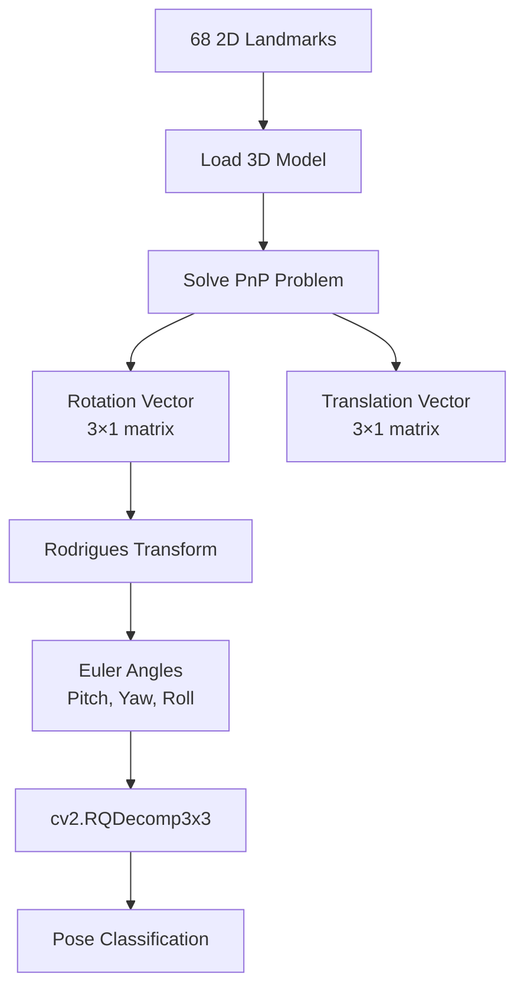
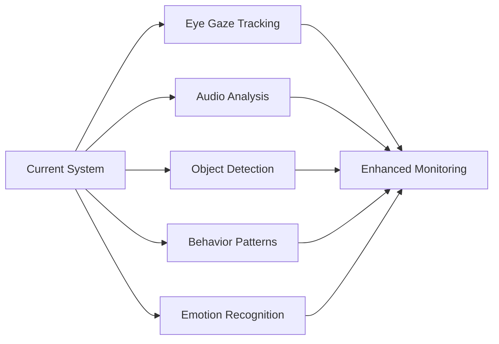

<div align="center">

# 🎓 Pariksha Guardian Nexus - AI Model Documentation

### *Intelligent Exam Proctoring with Computer Vision & Deep Learning*

[](https://www.python.org/)
[](https://tensorflow.org/)
[](https://opencv.org/)
[](https://flask.palletsprojects.com/)

</div>

---

## 📋 Table of Contents

- [Overview](#-overview)
- [Architecture & Algorithms](#-architecture--algorithms)
- [Project Structure](#-project-structure)
- [API Endpoints](#-api-endpoints)
- [Dependencies](#-dependencies)
- [Quick Start](#-quick-start)
- [Performance Metrics](#-performance-metrics)
- [Proctoring Logic](#-proctoring-logic)
- [Future Enhancements](#-future-enhancements)

---

## 🎯 Overview

The **Pariksha Guardian Nexus** implements a sophisticated **multi-model AI architecture** for real-time exam proctoring, combining state-of-the-art computer vision algorithms to ensure academic integrity.

### ✨ Core Capabilities

<table>
<tr>
<td width="50%">

🔍 **Face Detection & Tracking**
- Real-time face localization
- High accuracy detection

</td>
<td width="50%">

📍 **68-Point Facial Landmarks**
- Precise feature extraction
- Sub-pixel accuracy

</td>
</tr>
<tr>
<td width="50%">

🧭 **Head Pose Estimation**
- 3D orientation tracking
- Gaze direction analysis

</td>
<td width="50%">

👥 **Multiple Person Detection**
- Unauthorized presence detection
- COCO dataset trained

</td>
</tr>
</table>

---

## 🧠 Architecture & Algorithms

### 1️⃣ Face Detection Module

<details>
<summary><b>📸 Click to expand: SSD-based Face Detector</b></summary>

#### **Algorithm**: Single Shot MultiBox Detector (SSD) with ResNet-10 backbone

**🔧 Model Specifications:**
| Parameter | Value |
|-----------|-------|
| Framework | OpenCV DNN (Caffe) |
| Input Size | 300×300 RGB |
| Model File | `res10_300x300_ssd_iter_140000.caffemodel` |
| Config File | `deploy.prototxt` |
| Confidence Threshold | 0.5 (default) |

**🔄 Processing Pipeline:**

```mermaid
graph LR
    A[Input Image] --> B[Blob Conversion<br/>300×300]
    B --> C[Mean Subtraction<br/>[104, 177, 123]]
    C --> D[SSD Forward Pass]
    D --> E[Confidence Filtering]
    E --> F[Bounding Boxes]
```

**⚡ Key Features:**
- Mean subtraction: `[104.0, 177.0, 123.0]`
- Returns bounding boxes with confidence scores
- Real-time processing capability

</details>

---

### 2️⃣ Facial Landmark Detection

<details>
<summary><b>🎯 Click to expand: CNN-based Landmark Detector</b></summary>

#### **Algorithm**: Convolutional Neural Network for Facial Landmark Regression

**🔧 Model Specifications:**
| Parameter | Value |
|-----------|-------|
| Framework | TensorFlow/Keras |
| Model Path | `assets/pose_model` |
| Input Size | 128×128 RGB |
| Output | 68 (x, y) coordinates |

**🎨 Landmark Distribution:**

```
    👁️ Eyes: Points 36-47 (12 points)
    👃 Nose: Points 27-35 (9 points)
    👄 Mouth: Points 48-67 (20 points)
    🎭 Jawline: Points 0-16 (17 points)
    👂 Eyebrows: Points 17-26 (10 points)
```

**🔄 Processing Pipeline:**

1. 🔍 Extract face region using `FaceDetector`
2. 📐 Apply geometric transformations:
   - ⬇️ Box offset (12% downward)
   - ⬛ Square box expansion
   - ✅ Boundary validation
3. 📏 Resize to 128×128 pixels
4. 🧠 CNN inference for 68 landmarks
5. 🔄 Transform coordinates to original space

</details>

---

### 3️⃣ Head Pose Estimation

<details>
<summary><b>🧭 Click to expand: PnP-based Pose Estimator</b></summary>

#### **Algorithm**: Perspective-n-Point (PnP) with 3D-2D Correspondence

**🔧 Model Specifications:**
| Parameter | Value |
|-----------|-------|
| Method | `cv2.solvePnP` (iterative) |
| 3D Model | 68-point facial model |
| Model File | `assets/model.txt` |
| Camera Model | Pinhole camera |

**🎯 Pose Classification Thresholds:**

| Pose Direction | Angle Range | Status |
|---------------|-------------|---------|
| 👆 Looking Up | Pitch < -15° | ⚠️ Warning |
| 👇 Looking Down | Pitch > 15° | ⚠️ Warning |
| 👈 Looking Left | Yaw < -20° | ⚠️ Warning |
| 👉 Looking Right | Yaw > 20° | ⚠️ Warning |
| 👁️ Looking Straight | \|pitch\| < 10° AND \|yaw\| < 10° | ✅ Normal |

**🔄 Processing Pipeline:**



**📊 Output Vectors:**
- 🔄 **Rotation Vector**: 3×1 axis-angle representation
- 📍 **Translation Vector**: 3×1 camera position
- ⚙️ Uses previous frame for temporal stability

</details>

---

### 4️⃣ Multiple Person Detection

<details>
<summary><b>👥 Click to expand: EfficientDet Detector</b></summary>

#### **Algorithm**: EfficientDet D0 Object Detection

**🔧 Model Specifications:**
| Parameter | Value |
|-----------|-------|
| Framework | TensorFlow Hub |
| Model | `tensorflow/efficientdet/d0/1` |
| Dataset | COCO (80 classes) |
| Person Class ID | 1 |
| Confidence Threshold | 0.5 |

**🔄 Detection Process:**

1. 📥 Load pre-trained EfficientDet D0
2. 🔍 Full image object detection
3. 🎯 Filter for "person" class (ID=1)
4. ✂️ Apply confidence threshold
5. 🔢 Count detected persons

</details>

---

## 📁 Project Structure

```
model/
├── 📂 assets/                          # Model files & configurations
│   ├── 📄 deploy.prototxt              # SSD architecture
│   ├── 📦 res10_300x300_ssd_iter_140000.caffemodel
│   ├── 📂 pose_model/                  # CNN landmark model
│   └── 📄 model.txt                    # 3D facial coordinates
├── 🖼️ images/                          # Documentation images
├── 🐍 mark_detector.py                 # Face & landmark detection
├── 🐍 pose_estimator.py                # Head pose estimation
└── 🐍 app.py                           # Flask API server
```

---

## 🚀 API Endpoints

### REST API Server (Flask)

<details>
<summary><b>🔵 POST `/predict_pose` - Basic Pose Detection</b></summary>

**Purpose**: Basic head pose detection and classification

**📥 Request:**
```json
{
  "img": "data:image/jpeg;base64,/9j/4AAQSkZJRg..."
}
```

**📤 Response:**
```json
{
  "message": "face found",
  "pose": {
    "rotation_vector": [0.12, -0.05, 0.03],
    "translation_vector": [-15.2, -10.5, -2050.1]
  },
  "head_pose": {
    "looking_up": false,
    "looking_down": false,
    "looking_left": false,
    "looking_right": false,
    "looking_straight": true,
    "pitch": -5.2,
    "yaw": 3.1,
    "roll": 1.8
  },
  "warnings": []
}
```

</details>

<details>
<summary><b>🟢 POST `/predict_pose_detailed` - Enhanced Detection with Visualization</b></summary>

**Purpose**: Pose detection with annotated image output

**✨ Additional Features:**
- 📍 Visual annotations on face
- 🎯 Facial landmarks overlay
- 📊 Pose angle text display
- ⚠️ Warning indicators
- 🖼️ Returns annotated base64 image

**📤 Response:**
```json
{
  "message": "face found",
  "pose": { ... },
  "head_pose": { ... },
  "annotated_image": "data:image/jpeg;base64,...",
  "warnings": ["Student is looking left"]
}
```

</details>

<details>
<summary><b>🟣 POST `/predict_people` - Multiple Person Detection</b></summary>

**Purpose**: Detect unauthorized persons in frame

**📤 Response:**
```json
{
  "people": 2,
  "image": "image"
}
```

</details>

<details>
<summary><b>🟡 POST `/save_img` - Image Audit Storage</b></summary>

**Purpose**: Save captured images for compliance audit

</details>

<details>
<summary><b>🟢 GET `/health` - Health Check</b></summary>

**Purpose**: System status verification

**📤 Response:**
```json
{
  "status": "healthy",
  "model": "loaded",
  "endpoints": ["/predict_pose", "/predict_pose_detailed", ...]
}
```

</details>

---

## 📦 Dependencies

### Core Technology Stack

<table>
<tr>
<td align="center" width="25%">

<br><b>Deep Learning</b>
<br>Framework for CNN models
</td>
<td align="center" width="25%">

<br><b>Computer Vision</b>
<br>DNN module, PnP solver
</td>
<td align="center" width="25%">

<br><b>Numerical Computing</b>
<br>Array operations
</td>
<td align="center" width="25%">

<br><b>REST API</b>
<br>Server framework
</td>
</tr>
</table>

### 📋 Required Model Files

| File | Purpose |
|------|---------|
| `deploy.prototxt` | SSD architecture definition |
| `res10_300x300_ssd_iter_140000.caffemodel` | Pre-trained SSD weights |
| `assets/pose_model/` | Keras landmark detection model |
| `assets/model.txt` | 3D facial landmark coordinates |

---

## ⚡ Quick Start

### 🔧 Initialize Models

```python
from mark_detector import MarkDetector, FaceDetector
from pose_estimator import PoseEstimator

# Initialize detectors
mark_detector = MarkDetector()
pose_estimator = PoseEstimator(img_size=(height, width))

# Detect face
facebox = mark_detector.extract_cnn_facebox(image)

# Detect landmarks
marks = mark_detector.detect_marks(face_image)

# Estimate pose
rotation_vector, translation_vector = pose_estimator.solve_pose_by_68_points(marks)
```

### 🚀 Run Flask Server

```bash
python app.py
# 🌐 Server runs on http://0.0.0.0:8080
```

---

## 📊 Performance Metrics

<table>
<tr>
<th>Algorithm</th>
<th>Speed</th>
<th>Accuracy</th>
<th>Notes</th>
</tr>
<tr>
<td><b>🔍 Face Detection</b></td>
<td>⚡ 30-50ms</td>
<td>🎯 High (0.9 threshold)</td>
<td>⚠️ Struggles with extreme lighting</td>
</tr>
<tr>
<td><b>📍 Landmark Detection</b></td>
<td>⚡ 10-20ms</td>
<td>🎯 Sub-pixel precision</td>
<td>✅ Requires good face detection</td>
</tr>
<tr>
<td><b>🧭 Pose Estimation</b></td>
<td>⚡ 5-10ms</td>
<td>🎯 ±5-10° error</td>
<td>🔄 Temporal smoothing enabled</td>
</tr>
<tr>
<td><b>👥 Person Detection</b></td>
<td>⚡ 100-200ms</td>
<td>🎯 mAP ~34%</td>
<td>📊 COCO dataset performance</td>
</tr>
</table>

---

## 🚨 Proctoring Logic

### Suspicious Behavior Detection

<table>
<tr>
<td width="50%">

#### ⚠️ Warning Triggers

| Behavior | Detection Method |
|----------|------------------|
| ❌ **No Face** | Face detection fails |
| 👆 **Looking Up** | Ceiling reference check |
| 👇 **Looking Down** | Notes/phone detection |
| 👈👉 **Looking Sideways** | Collaboration detection |
| 👥 **Multiple People** | Unauthorized assistance |

</td>
<td width="50%">

#### ✅ Normal Behavior

```
┌─────────────────────┐
│                     │
│    👁️ Straight     │
│   Gaze Forward      │
│                     │
│  |Pitch| < 10°      │
│  |Yaw| < 10°        │
│                     │
└─────────────────────┘
```

</td>
</tr>
</table>

---

## 🔮 Future Enhancements

<div align="center">

### 🎯 Roadmap



</div>

| Feature | Description | Status |
|---------|-------------|--------|
| 👁️ **Eye Gaze Tracking** | Precise attention monitoring | 🔜 Planned |
| 🔊 **Audio Analysis** | Suspicious sound detection | 🔜 Planned |
| 📱 **Object Detection** | Phone, books, materials | 🔜 Planned |
| 📈 **Temporal Analysis** | Behavior pattern tracking | 🔜 Planned |
| 😊 **Emotion Recognition** | Stress detection | 🔜 Planned |

---

<div align="center">

### 💡 Built with ❤️ for Academic Integrity

**Made with cutting-edge AI/ML technologies**

[](https://github.com)
[](.)
